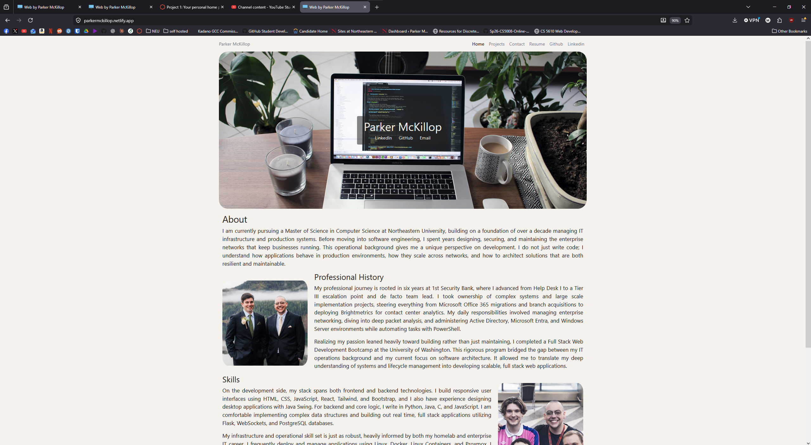
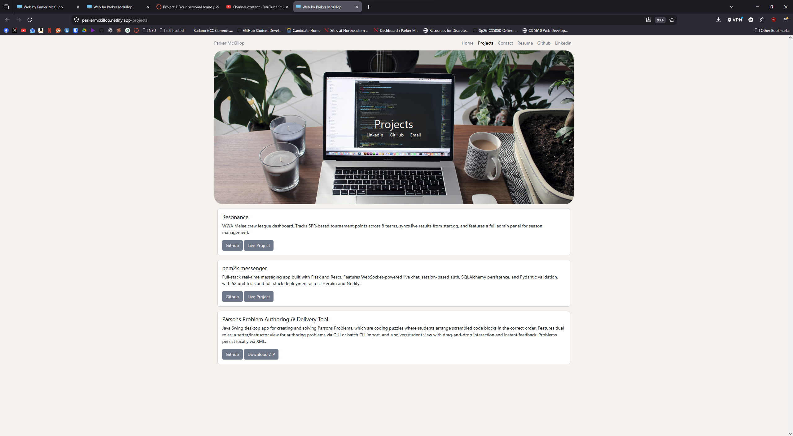
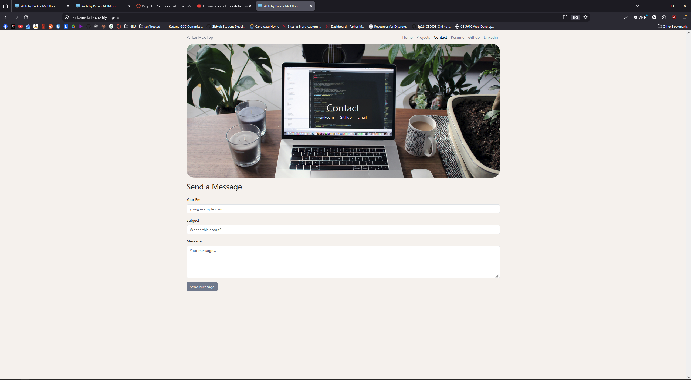

# Parker McKillop — Personal Portfolio

**Author:** Parker McKillop
**Class:** [CS 5610 Web Development](https://johnguerra.co/classes/webDevelopment_online_summer_2026/)
**Live Site:** [parkermckillop.netlify.app](https://parkermckillop.netlify.app)

## Objective

A personal portfolio and professional homepage built to showcase projects, skills, and background as a web developer and CS student. Project cards are dynamically rendered from a JSON data file using a vanilla ES6 JavaScript module — no frameworks, no jQuery.

## Design Documents
[Design/designdocument.md](Design/designdocument.md)

## Screenshot





## Video Overview:
https://youtu.be/VucYKUd6hzs

## Pages

- **index.html** — Homepage with about section and skills
- **projects.html** — Dynamically rendered project cards from `src/js/projects.json`
- **contact.html** — Contact form with Formspree integration *(AI-generated page)*

## How to Run Locally

This is a static site — no build step required.

```bash
git clone https://github.com/pem2k/CS5610-Project-01-Portfolio.git
cd CS5610-Project-01-Portfolio
npx serve .
```

Then open `http://localhost:3000` in your browser.


## GenAI Disclosure

Claude CLI (Sonnet 4.6) was used in the following ways during this project:

- **Organizational tool** — generated a prioritized task list from the rubric at the start of the project
- **Syntax reference** — used as a general JavaScript/HTML/CSS reference throughout development
- **Contact page layout** — the initial layout and form submission logic for `contact.html` was AI-generated, then reviewed and integrated manually
- **Logistics** — assisted with removing an accidentally committed `node_modules` folder from git history
- **Readme** — used to generate readme.md as a full stack engineer with specific rubric guided instructions and user information.
